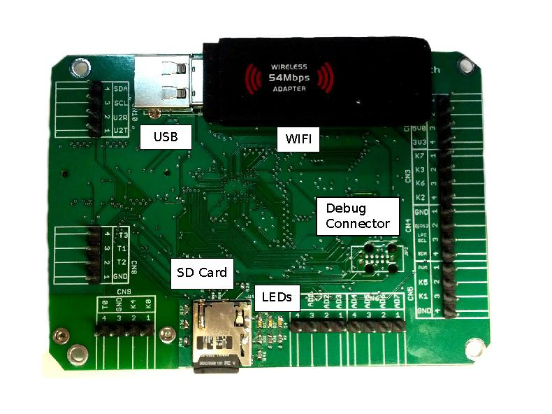
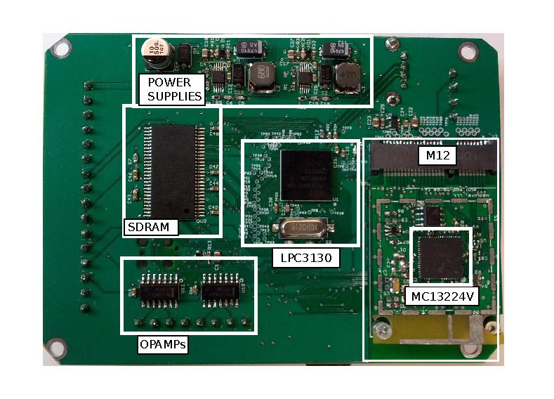

Seascope SBC: Open hardware linux single board computer for robotics
====================================================================

The Seascope SBC is an open hardware single board computer that runs
linux with a formfactor suitable for robotics. 

Inexpesive
----------

The CPU and ram section has BOM cost of aprox. $5

Open Hardware and easy to cutomize
----------------------------------

The board is licensed under CC-BY-SA: get hacking

The files are made with Eagle and routed with
(http://www.freerouting.net); don't be intimidated by the layout ---
freerouting makes changes very easy!

Uboot:
======

See (https://github.com/jonsmirl/lpc31xx-uboot/wiki)

Linux:
======

See (https://github.com/jonsmirl/lpc31xx/wiki)

Distributions:
==============

Arch:
-----

Image downloads:
(http://archlinuxarm.org/developers/downloads)

Either of the ARMv5te images should work.
